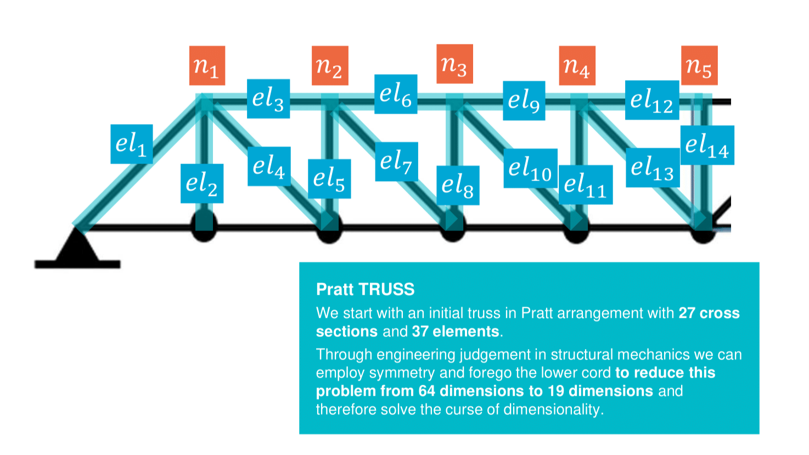

# Bayesian optimization for truss structures

Structures that make optimal use of the material they are made of reduces the cost and environmental impact of their construction as the amount of material required. Optimization of structural design is a challenging task because of the high number of design parameters and the relatively expensive evaluation of the suitability of any given design. Standard optimization techniques in high-dimensional design space require a very large number of possible designs that need to be evaluated. In structural analysis, where evaluating the objective function and checking the constraints involves the solution of a structural mechanics problem, e.g. with finite elements, this quickly becomes very expensive, even if the model is relatively simple from structural point of view. Bayesian optimization is a machine-learning-based optimization technique that aims to reduce the number of evaluations of the objective function through data-driven exploration of the design space with a probabilistic surrogate.

> <span style="font-size: larger;"><B>Project Objective:</B></span> To find the optimal truss design <br>
> To solve this optimisation problem, we need to find the optimal set of nodal coordinates and cross-sectional properties. This will allow us to minimize the total weight of the structure while satisfying various constraints related to the structure's natural frequencies. We will evaluate the bayesian optimisation approach by comparing it with [Kanarachos et al., 2017](https://dx.doi.org/10.1016/j.compstruc.2016.11.005),

| | |
|----------------------------------------------------------------------------------------------------------|--------------------------------------------------------------------------------------------------|
|**Figure 1:** Visualisation of a Multi-dimensional solution space | **Figure 2:** TRUSS optimisation problem formulation |

We start with an initial truss in Pratt arrangement with **27 cross sections and 37 elements**. Through engineering judgement in structural mechanics we can employ symmetry and forego the lower cord to reduce this problem from **64 dimensions to 19 dimensions** and therefore solve the curse of dimensionality. The problem formulation is the following, 

$$
OF = \min_{\theta,\gamma} \mathbb{E}_{\sim P_{\text{data}}}[L(\gamma ;\theta)] \quad \text{(1)}
$$
$$
\text{with solution space} \left\{
\begin{array}{c|cccccc}
& \gamma_1 & \gamma_2 & \dots & \gamma_{14} \\ \hline
\theta_1 & f(\theta_1, \gamma_1) & f(\theta_1, \gamma_2) & \dots & f(\theta_1, \gamma_{14}) \\
\vdots  & \vdots  & \vdots  & \ddots  & \vdots \\
\theta_5 & f(\theta_5, \gamma_1) & f(\theta_5, \gamma_2) & \dots & f(\theta_5, \gamma_{14})
\end{array} 
\right. \quad \text{(2)}
$$
$$
\text{subject to constraints} \quad \left\{
\begin{array}{l}
\omega_1 \geq 20, \\
\omega_2 \geq 40, \quad \text{and} \quad A_{1-15} > 0 \\
\omega_3 \geq 60, \\
\end{array}
\right. \quad \text{(3)}
$$

As can be seen we work with some constraints 

Solving the above problem requires the use of gradient based methods which we build on top our Machine learning model supported by different functions to facilitate the exploration and learning of the solution space. The before approach serves to illustrate the efficacy of expanding current optimization methods and through implementation of machine learning methods and how we can improve the convergence speed and problem complexity of possible problems . The following figures illustrat

|  |  |
|----------------------------------------------------------------------------------------------------------|--------------------------------------------------------------------------------------------------|
|**Figure 3:** **Kanarachos** truss typology optimal solution  | **Figure 4:** **TRUSS** truss typology optimal solution  |

## Breakdown of the Bayesian Optimization analysis

The solution method employed in the Bayesian optimizer involves several key steps but it fundamentally works in the following way. 

### 1. Algorithm Initiation

We initiate by performing a random search in the solution space. To do so we first constrain our solution space by defining our **bounds** to exploration locations which may produce sensical values and hence not throw off the algorithm excessively when searching. We then **normalise** our data through `MinMaxscaler` for the contributions of the coordinates and and areas to be of equal weight despite unequal magnitudes. We then initiate the other hyperparameters of the `TRUSS` object, this includes the loss function components such as the violation factor and corresponding weights of the mass and frequency components of the loss function which if well formulated should evaluate the proximity to a optimal solution.

### 2. Gaussian process characteristics & fitting

We then fit the initiated vector (n-vectors of random areas for the 14 element and the top 5 coordinates) with the calculated n targets (values of the loss function) to a single task Gaussian process `SingleTaskGP` through the `set_train_data` function. This Gaussian process makes use by default use of a Matern kernel although this can be changed through the `covar_module` since the use of Matern kernel is of interest to us this was left unchanged. The Matern kernel can be expressed in the following way,

$$
k(\mathbf{x}, \mathbf{x'}) = \frac{\sigma_{f}^2}{\Gamma(\nu)2^{\nu-1}} \left(1 + \frac{\left\| \sqrt{2\nu}d/\ell \right\|^2}{\nu}\right)^{-\nu}K_{\nu}\left(\sqrt{2\nu}d/\ell\right)
$$ 

Additionally, we then set the `SingleTaskGP` loss evaluation through the `ExactMarginalLogLikelihood`, 

$$
\mathcal{L} = p_f(\mathbf{y} | \mathbf{X}) = \int p \left( \mathbf{y} | f(\mathbf{X}) \right) \cdot p(f(\mathbf{X}) | \mathbf{X}) \, df \quad \text{(3)}
$$

>**NOTE**: The decision to use a single task gp was a decision to simplify the problem through accounting the different components of the loss function through additional hyperparameters (i.e the NF and mass component weights of the loss function) nevertheless, it could be interesting to explore the use multi-task GP's.

### 3. The algorithm process 

We now intiate the convergence solver where we iteratively try to minimise the loss thorugh a gradient descent method in the `optimize_acqf` and through the choice of the `Expectedimprovement` function

Moreover all the above process was narrowed down into the following code excerpt through `BoTorch`, our own Bayesian optimiser can also be found in [TRUSS_BOPT.py](TRUSS1/truss_bridge/TRUSS_Bopt.py),

```python
def SingleBOPT(Y_init_single, X_init_single, n_iter, batch_size, Nrestats, objective_function):
    gp_model = SingleTaskGP(X_init_single, Y_init_single)
    mll = ExactMarginalLogLikelihood(gp_model.likelihood, gp_model)
    fit_gpytorch_model(mll)
    gp_model.set_train_data(inputs=X_init_single, targets=Y_init_single.flatten(), strict=False)
    
    for iteration in range(n_iter):
        print(f'Iteration: {iteration} Best loss = {Y_init_single.min().item():.2f}\n')
        acq_func = ExpectedImprovement(model=gp_model, best_f=Y_init_single.min(), maximize=False)
        new_x, _ = optimize_acqf(
            acq_function=acq_func,
            bounds=bounds,
            q=1,
            num_restarts= Nrestats,
            raw_samples= batch_size,
        )
        new_x_unnorm = unnormalize(new_x, bounds=bounds)
        new_y = objective_function(new_x_unnorm)
        new_y = torch.tensor(new_y, dtype=torch.float32).reshape(1,-1)
        X_init_single = torch.cat([X_init_single, new_x])
        Y_init_single = torch.cat([Y_init_single, new_y])
        
        gp_model.set_train_data(inputs=X_init_single, targets=Y_init_single.flatten(), strict=False)
        fit_gpytorch_model(mll)
    return X_init_single, Y_init_single
```
And thats it! Thats how easy a proceedure we can make use of to perform efficient informed optimisation with non implementable constraints. The above process is also described in the following figure,


**Figure 5:** A description of the solution method through the optimiser and its different components. 

## Results


## Repo structure and contents
- 口Reading includes the original paper and reference, investigation and reference results obtained with other optimization approaches, check this paper: [Kanarachos et al., 2017](https://dx.doi.org/10.1016/j.compstruc.2016.11.005)
- **pyJive**: a finite element code that can compute the natural frequencies of a given truss design, which can be treated as black box model for this project
- **truss_bridge**: a directory with input files for the case of the project, including a [notebook](truss_bridge/truss_bridge.ipynb) with a demonstration of how to interact with the finite element code
- **Truss notebook**: The Jupyter notebook containing the implementation of the Bayesian optimiser and the posterior analysis. It covers a from blank implementation, a solution through Botorch module and a posterior analysis on the behaviour of the algorithm against [Kanarachos et al., 2017](https://dx.doi.org/10.1016/j.compstruc.2016.11.005) and its covergence behaviour. 
- **End of project presentation**: A breakdown of the project and some of its detail can be found in [TrussBOPT.pptx](TRUSS1/TRUSS1/TrussBOPT_EOP.pptx).

### Useful links
The original publication:
- Approach undertaken by Kanarachos through a pure optimisation approach, check this paper for the publication: [https://dx.doi.org/10.1016/j.compstruc.2016.11.005](https://dx.doi.org/10.1016/j.compstruc.2016.11.005)

Tutorials on Bayesian optimization:
- [https://towardsdatascience.com/bayesian-optimization-a-step-by-step-approach-a1cb678dd2ec](https://towardsdatascience.com/bayesian-optimization-a-step-by-step-approach-a1cb678dd2ec)
- [https://www.ritchievink.com/blog/2019/08/25/algorithm-breakdown-bayesian-optimization](https://www.ritchievink.com/blog/2019/08/25/algorithm-breakdown-bayesian-optimization)
